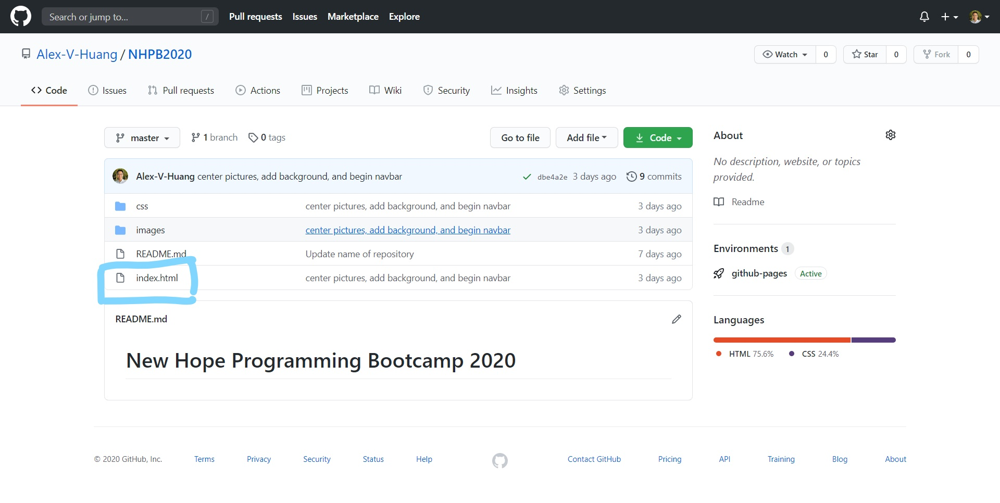
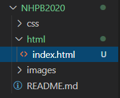
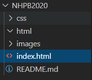
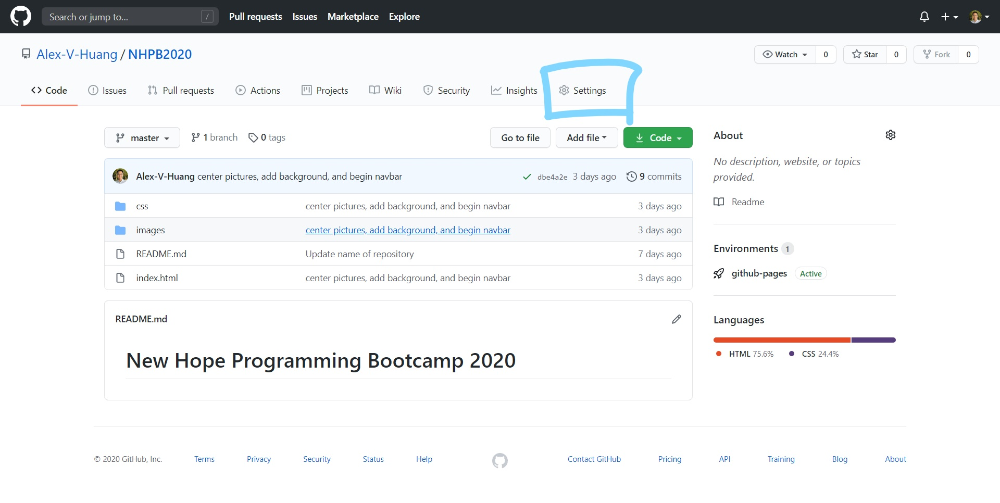

# Hosting Your Website on GitHub

## Publishing Your Website
- So far, we have only been able to view our website on our computers. The only way to run your website is if you have the code.
- Making your website accessible online is a great way to share your work with anyone, anywhere!
- The goal of this exercise is to walk through how to publish our websites online using GitHub Pages.

1. Go to your website repository on GitHub.


2. Check to see if your index.html exists in your project's top-level directory.



- In other words, **if you see your index.html file** on your GitHub repository without having to click through a folder(s), you are good to go! **Please skip Step 3 and go to Step 4.**

- **If you do not see your index.html file** unless you click through a folder(s), you will need to move your index.html file to your project's top-level directory. **Please continue to Step 3.**

3. Open VS Code. Move your index.html file to your project's top-level directory. This can be done by dragging and dropping or cutting and pasting.




Example: before and after. Notice how index.html was moved out of the html folder and into the NHPB2020 folder (top-level directory).

- Note: **By moving your index.html, you may need to update your code as well.** For example, many of your ```href``` values can no longer find the stylesheet, images, or other files that index.html is looking for. This is because you have changed where index.html resides. Please update your index.html as needed.

4. Publish your changes on your website from your local computer to your GitHub repository. This ensures that your hosted website on GitHub is up-to-date.

- If you forgot how to publish your changes to GitHub, please visit "Making Changes to Your Repository" from the [Git Commands](https://github.com/Alex-V-Huang/NewHopeBootcamp/blob/master/Week2/Week2.1/Git_Commands.md) exercise.

5. On your website repository on GitHub, click on Settings. Settings is the last tab on the far-right.




Scroll down to the second-to-last section titled "GitHub Pages". Under "Source", click on the drop-down menu and select "master". Click Save.


After saving, the webpage should refresh. Scroll back down to "GitHub Pages". The section should look a little different than before, with a new link to your newly published website at the top. Open the link in a new tab.


6. At your hosted website, you will see a 404 error message at first. This is typical behavior.


Refresh the page every other minute. **GitHub Pages may take up to ten minutes to host your website.** If successful, your website has gone live!


## Updates to Your Hosted Website
- You do not need to worry about your hosted website whenever you publish a change to GitHub. Activating GitHub Pages is a one-and-done task!
- Your hosted website will automatically update as you publish new changes to your GitHub repository.

1. On your website repository on GitHub, click on Environments. Environments is in the bottom-right of the page.


2. This will reveal the update history of your hosted website. Clicking on any of "View deployment" buttons will take you to your website's current state hosted on GitHub Pages.


